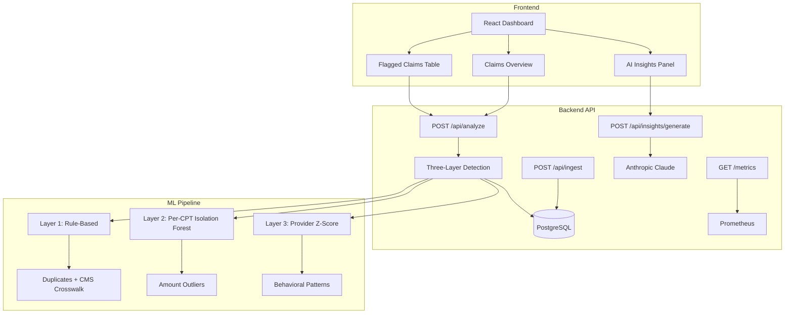

# Valentis

**Hospital Revenue & Payment Risk Intelligence Platform**

Valentis is a predictive revenue intelligence and fraud detection layer that helps hospitals proactively protect revenue, detect suspicious financial activity, and optimize collections before accounts reach bad debt.

## Architecture



## Anomaly Detection — Three-Layer Architecture

| Layer | Method | What it catches | Why this approach |
|---|---|---|---|
| **Layer 1** | Rule-based (deterministic) | Duplicate claims, CPT/ICD-10 mismatches | No ML needed — duplicates are a lookup, mismatches are a crosswalk join against CMS reference data |
| **Layer 2** | Per-CPT Isolation Forest | Amount outliers by procedure code | Trained per CPT group because $800 is normal for an MRI but suspicious for a blood draw |
| **Layer 3** | Provider-level Z-score | Behavioral anomalies (volume, billing patterns) | Aggregate patterns that only appear when comparing providers as cohorts |

### Performance on 50K Synthetic Dataset

| Metric | Value |
|---|---|
| **Precision** | **90.67%** |
| **Recall** | **98.00%** |
| **F1 Score** | **94.19%** |
| Total claims | 50,000 |
| Ground truth anomalies | 3,152 (6.3%) |
| Predicted anomalies | 3,407 |

The LLM summarization layer (Anthropic Claude) generates plain-English provider analysis grouped by anomaly patterns. This is advisory only — all responses are marked as AI-generated insights for human review, not automated decisions. The batching logic groups anomalies by provider (top 20), summarizes each batch independently, and caps at 50 claims per prompt to manage context.

### Technical Decisions

- **Why Isolation Forest?** Unsupervised learning fits billing anomaly detection well — you rarely have labeled fraud data in production. Training one model per CPT code captures domain-specific amount distributions rather than treating all procedures as identical.
- **Why batch LLM calls by provider?** Dumping 500 flagged claims into one prompt exceeds useful context. Provider-level grouping produces targeted, actionable summaries.
- **Why the reviewed status workflow?** It makes the difference between a demo and a product. Persisting review state to the database creates an audit trail and lets teams track resolution progress.
- **CMS crosswalk reference data** is included as a seed file (`ml/data/cpt_icd10_crosswalk.csv`) so the mismatch detection uses actual clinical coding rules, not synthetic logic.

## Tech Stack

| Layer        | Technology                                    |
| ------------ | --------------------------------------------- |
| **Frontend** | React 18, Vite, Recharts, React Router        |
| **Backend**  | Python, FastAPI, Pandas, NumPy, Scikit-learn   |
| **Database** | PostgreSQL (production) / SQLite (local dev)   |
| **ML**       | Isolation Forest (per-CPT), Z-score, Rule engine |
| **AI**       | Anthropic Claude (advisory summarization)      |
| **Infra**    | Docker, Docker Compose, Render / Railway       |

## Quick Start

### Option 1: Docker (recommended)

```bash
cp .env.example .env
python -c "import secrets; print(secrets.token_hex(32))"  # add to .env as SECRET_KEY
docker compose up --build
```

- **Backend API**: http://localhost:8000/docs
- **Frontend**: http://localhost:3000

### Option 2: Local Dev

```bash
# Backend
cd backend && python -m venv venv && source venv/bin/activate
pip install -r requirements.txt
uvicorn app.main:app --reload

# Frontend (separate terminal)
cd frontend && npm install && npm run dev
```

## Data Pipeline

```bash
# Generate 50K-row synthetic dataset with 5% anomalies
cd backend && python scripts/generate_data.py

# Ingest into database
curl -X POST http://localhost:8000/api/ingest -F 'file=@scripts/claims_data.csv'

# Train model and run detection
curl -X POST http://localhost:8000/api/analyze

# Generate AI insights
curl -X POST http://localhost:8000/api/insights/generate
```

## Project Structure

```
valentis/
├── backend/
│   ├── ml/
│   │   ├── anomaly_detector.py   # Three-layer detection engine
│   │   ├── summarizer.py         # Anthropic LLM summarization
│   │   └── data/
│   │       └── cpt_icd10_crosswalk.csv  # CMS reference data
│   ├── app/
│   │   ├── routers/
│   │   │   ├── analyze.py        # POST /analyze, GET /anomalies
│   │   │   ├── summarize.py      # POST /insights/generate
│   │   │   ├── ingest.py         # POST /ingest (bulk CSV)
│   │   │   └── metrics.py        # GET /metrics (Prometheus)
│   │   ├── db/models.py          # claims + anomaly_flags tables
│   │   └── schemas/claims.py
│   └── scripts/generate_data.py  # Faker-based data generator
├── frontend/
│   └── src/
│       ├── pages/
│       │   ├── ClaimsOverview.jsx    # Stats + run analysis
│       │   ├── FlaggedClaims.jsx     # Paginated + mark reviewed
│       │   └── AIInsights.jsx        # Provider summaries
│       └── services/api.js
├── docker-compose.yml
└── render.yaml
```

## Security

- HIPAA-aligned data minimization — de-identified account IDs only, no PHI
- Role-based access control with TOTP 2FA
- Audit logging on all actions
- Secrets managed via environment variables
